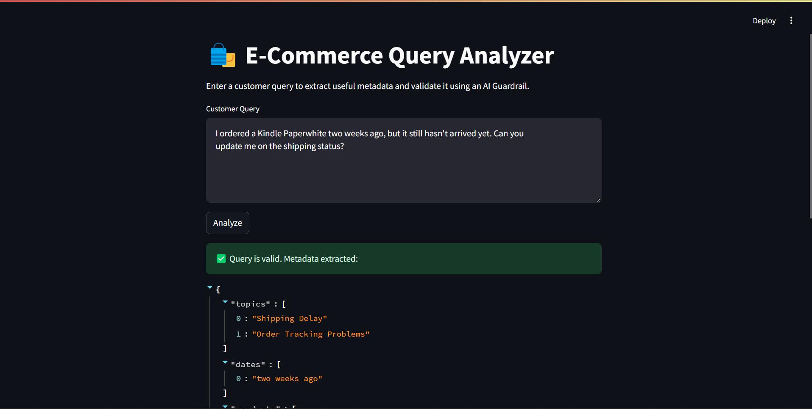

## Description
AI Agent built with openAI agents SDK to extract metadata from customers query in e-commerce domain.

## Getting Started

Follow these steps to set up the project on your local machine.

### Prerequisites
- Python 3.x installed on your system.

### Clone the Repository
```bash
git clone https://github.com/tharun-gutha-1104/openAI-agent.git
cd <repository-folder>
```

### Create and Activate a Virtual Environment
#### On Windows:
```bash
python -m venv venv
venv\Scripts\activate
```

#### On macOS/Linux:
```bash
python3 -m venv venv
source venv/bin/activate
```

### Install Dependencies
```bash
pip install -r requirements.txt
```

### Add Environment Variables
Add openAI key to .env file


## Usage

Instructions to Run the Project:

1. To directly run the project:
  - Execute the `agent.py` file in the terminal.
  - You can enter your query directly in the terminal after running the file.

2. To use the Streamlit interface:
  - Run the `streamlit_app.py` file using the command: `streamlit run streamlit_app.py`.
  - This will open the application in your default web browser, where you can interact with the project through a graphical interface.

  
"""
### Example Queries and Agent Responses

Here are some example customer queries and the structured outputs generated by the AI Agent:

#### Query 1:
**Customer Query:**
> I received the wrong size for my Adidas Ultraboost 23 running shoes yesterday.  
> Can you please help with replacing it ASAP? My order number is ORD782345.

**Agent's Structured Output:**
```json
{
  "topics": ["Wrong Item Received"],
  "dates": ["yesterday"],
  "products": ["Adidas Ultraboost 23 running shoes"],
  "order_number": "ORD782345",
  "requested_action": "replace wrong size",
  "sentiment": "Neutral",
  "urgency": "High",
  "intent": "request_replacement",
  "delivery_status": null,
  "payment_method": null,
  "platform": null,
  "language": "English",
  "customer_type": null,
  "issue_severity": "Moderate",
  "product_variant": null,
  "expected_resolution_time": "ASAP",
  "reference_to_past_ticket": false,
  "preferred_contact_method": null
}
```

#### Query 2:
**Customer Query:**
> I ordered a Kindle Paperwhite two weeks ago, but it still hasn't arrived yet.  
> Can you update me on the shipping status?

**Agent's Structured Output:**
```json
{
  "topics": ["Shipping Delay", "Order Tracking Problems"],
  "dates": ["two weeks ago"],
  "products": ["Kindle Paperwhite"],
  "order_number": null,
  "requested_action": "update shipping status",
  "sentiment": "Negative",
  "urgency": "Medium",
  "intent": "track_order",
  "delivery_status": null,
  "payment_method": null,
  "platform": null,
  "language": "English",
  "customer_type": null,
  "issue_severity": "Moderate",
  "product_variant": null,
  "expected_resolution_time": null,
  "reference_to_past_ticket": false,
  "preferred_contact_method": null
}
```

These examples demonstrate how the AI Agent extracts structured metadata from customer queries.
